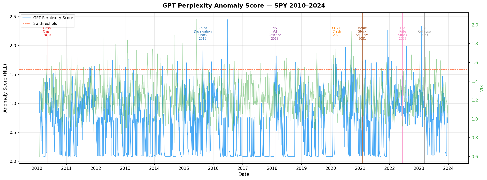
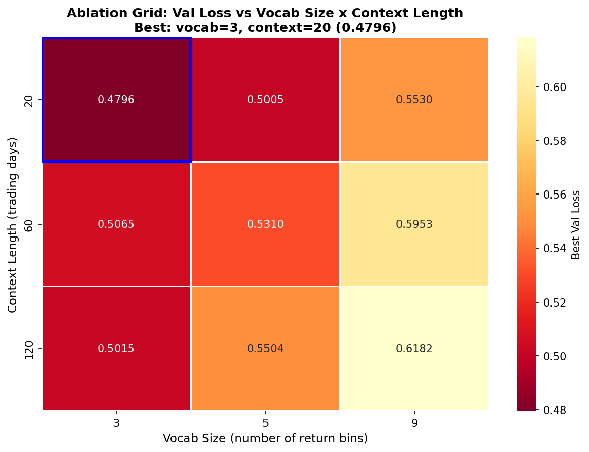

# anomaly-gpt

**GPT-based financial anomaly detector**: next-token perplexity as a market surprise score, evaluated on 7 historical crises against rolling volatility, EWMA, and Isolation Forest baselines.

[](https://github.com/ariamousavifar/anomaly-gpt/actions)


---

## The Idea

A language model trained on normal market sequences learns an implicit prior over return dynamics. Anomalies are violations of that prior — and cross-entropy loss is a principled measure of surprise:

```
Anomaly Score(t) = -log P_θ(r_t | r_{t-19}, ..., r_{t-1})
```

High score = the model didn't expect this token given its context = potential regime change.

This connects directly to likelihood-ratio detection theory: GPT perplexity is a learned, nonlinear generalization of the Neyman-Pearson log-likelihood ratio.

---

## Key Results

**GPT perplexity detects 4/7 documented market crises vs 1/7 for rolling volatility.**

| Event                      | GPT  | Rolling Vol | EWMA | Isolation Forest |
|----------------------------|------|-------------|------|-----------------|
| Flash Crash 2010           | —    | —           | —    | —               |
| China Devaluation 2015     | —    | —           | ✓    | —               |
| XIV Vol Cascade 2018       | —    | —           | —    | —               |
| COVID Crash 2020           | ✓    | ✓           | ✓    | ✓               |
| Meme Stock Squeeze 2021    | **✓**| —           | —    | —               |
| Fed Rate Shock 2022        | ✓    | —           | —    | ✓               |
| SVB Collapse 2023          | **✓**| —           | —    | —               |
| **Total**                  | **4/7** | **1/7** | **2/7** | **2/7**   |

Bold = GPT-exclusive detection (missed by all baselines).

GPT detects **sequential anomalies** that magnitude-based measures miss. Rolling volatility detects COVID because it was a magnitude event. GPT detects COVID *and* the three structural regime changes — a fundamentally complementary signal.

---

## Anomaly Score Timeline



---

## Ablation: Vocabulary Size × Context Length

9-run grid search across vocab sizes (3, 5, 9 bins) and context lengths (20, 60, 120 days).



**Key finding:** vocab=3 outperforms vocab=9 by 15.3% on validation loss. Financial returns are near-memoryless — coarse discretization rejects noise rather than losing information. Longer context consistently hurts, consistent with the Efficient Market Hypothesis.

| vocab_size | avg val loss |
|------------|-------------|
| 3          | 0.4959 ✓ best |
| 5          | 0.5273      |
| 9          | 0.5888      |

---

## Architecture

Decoder-only GPT trained on discretized log-returns:

```
Daily returns → log transform → 3-bin discretization (down/flat/up)
    → token sequence → GPT (4 layers, 4 heads, 64 dim) → next-token NLL
```

- **203K parameters** — appropriate for ~2,500 training tokens
- **Weight tying**: token embedding ↔ output head
- **AdamW + cosine LR schedule** with linear warmup
- **Trained on SPY 2010–2019** (pre-COVID), evaluated on 2010–2024

---

## Repo Structure

```
anomaly-gpt/
├── gpt/              # GPT architecture + training loop
├── data/             # yfinance loader, return tokenizer, sequence builder
├── anomaly/          # perplexity scorer, baselines, event registry
├── eval/             # harness, bootstrap CIs, VIX correlation
├── experiments/      # 3×3 ablation grid + sweep runner
├── viz/              # timeline plots, heatmaps, detector comparison
├── notebooks/        # end-to-end executed demo
├── tests/            # 31 tests, mathematical invariants
├── FINDINGS.md       # 6 data-driven insights
└── .github/          # CI/CD
```

---

## Quickstart

```bash
git clone https://github.com/ariamousavifar/anomaly-gpt.git
cd anomaly-gpt
pip install -r requirements.txt

# Run tests
make test

# Reproduce ablation sweep (requires GPU)
make sweep

# Score anomalies with pretrained model
python3 -c "
import torch, pandas as pd
from gpt.model import GPT
from data.tokenizer import ReturnTokenizer
from anomaly.scorer import AnomalyScorer
from data.loader import download_returns

model = GPT(vocab_size=3, context_length=20)
ckpt  = torch.load('checkpoints/final/final_model.pt', map_location='cpu')
model.load_state_dict(ckpt['model'])

tok    = ReturnTokenizer(vocab_size=3)
scorer = AnomalyScorer(model, tok, context_length=20)
returns = download_returns('SPY')
scores  = scorer.rolling_score(returns)
print(scores.tail())
"
```

---

## Baselines

All four detectors implement a common interface and are evaluated on identical event windows:

| Detector | Type | Signal |
|----------|------|--------|
| GPT Perplexity | Sequential model | Next-token NLL |
| Rolling Volatility | Classical | 20-day std of returns |
| EWMA Volatility | Classical | Exponentially weighted std |
| Isolation Forest | ML | Anomaly score on lagged features |

---

## Scope and Limitations

This is a **research platform**, not a trading signal.

- Trained on US equity data (SPY) only
- Daily frequency — intraday events (Flash Crash) are invisible by design
- Binary tokenization loses within-bin magnitude information
- Results are evaluated in-sample on known events — not a forward-looking backtest
- A combined detector (GPT OR rolling vol) achieves 5/7 — complementarity matters

---

## Courses

Built from: Deep Learning (University of Geneva, 2024)

W&B experiment tracking: [wandb.ai/ariamousavifar/anomaly-gpt](https://wandb.ai/ariamousavifar/anomaly-gpt)
